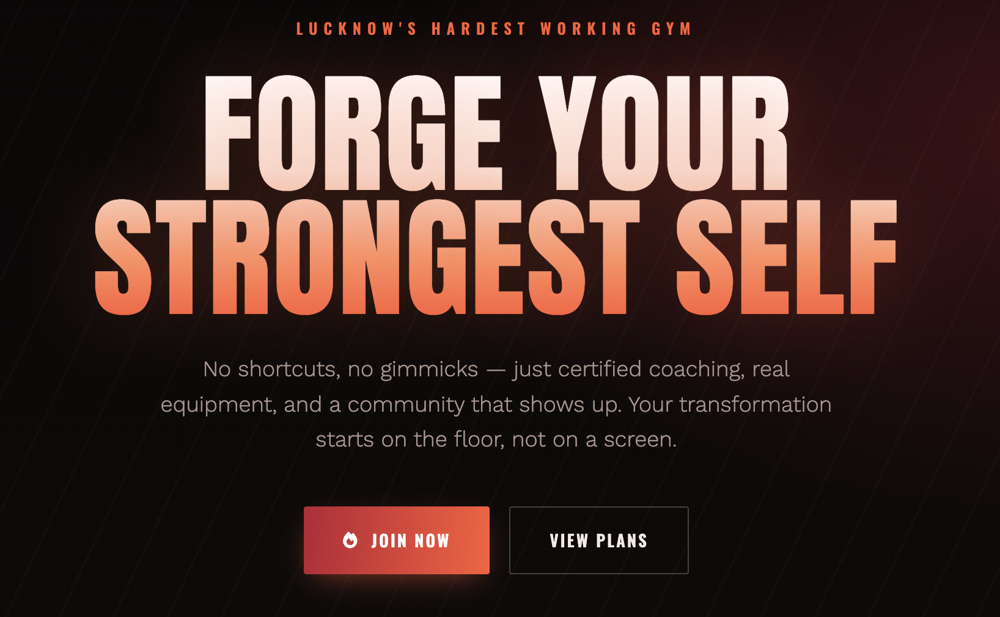
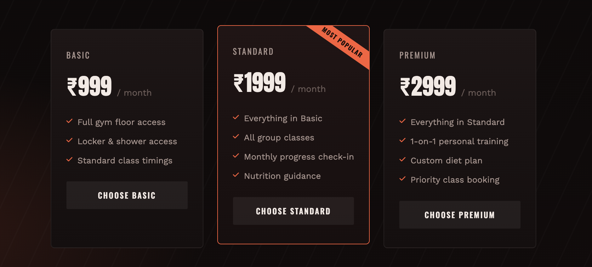
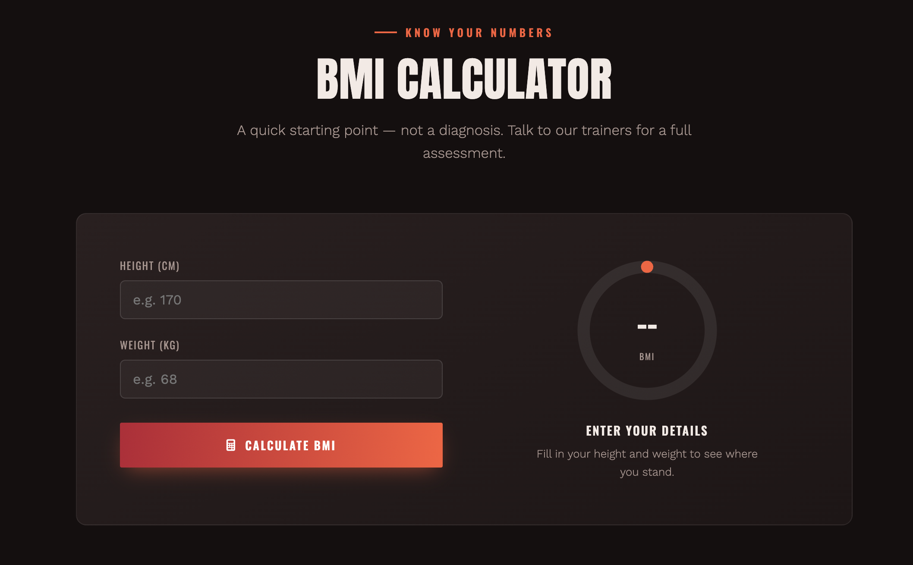
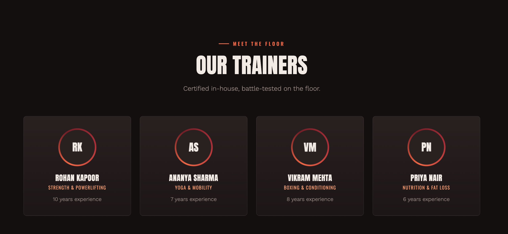
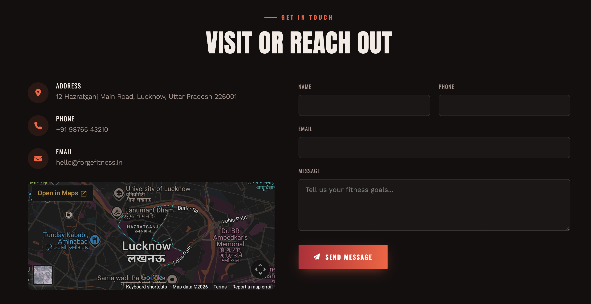

# 🏋️ Forge Fitness

A modern and responsive gym website built using HTML, CSS, and JavaScript.

## 🌐 Live Demo

https://assistant18689-cmyk.github.io/gym-website/

## ✨ Features

- Modern dark-themed UI
- Fully responsive design
- Hero section
- About section
- Membership plans
- Trainers section
- Class schedule
- BMI Calculator
- Gallery
- Testimonials
- FAQ section
- Contact form
- Smooth scrolling navigation

## 🛠 Technologies Used

- HTML5
- CSS3
- JavaScript

## 📸 Screenshots

(Add screenshots here later)

## 📂 Project Structure

```
gym-website/
│
├── index.html
├── README.md
└── favicon.png
```

## 🎯 Purpose

This project was built to practice front-end web development and create a professional business website suitable for a real fitness brand.

## 👨‍💻 Author

GitHub: https://github.com/assistant18689-cmyk


## 📸 Screenshots

### Home Page



### Membership Plans



### BMI Calculator



### Trainers



### contact


